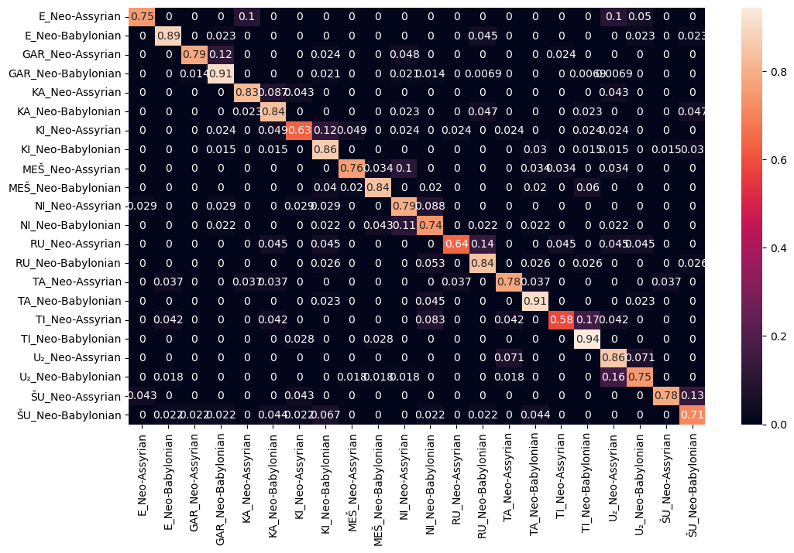

# Sign Classification Task

# Repository Updates (2026)

This section summarizes recent extensions to the original sign-classification framework.

## Extended Dataset

The original era-classification dataset has been extended using sign annotations from the Electronic Babylonian Library (EBL).

### Dataset Statistics

| Property | Value |
|-----------|-----------|
| Total sign crops | 133,791 |
| Sign classes | 482 |
| Minimum samples per class | 100 |
| Train split | 65% |
| Validation split | 15% |
| Test split | 20% |

A tablet-holdout evaluation protocol was introduced to ensure that sign crops originating from the same tablet do not appear in both training and testing sets.

---

## Models Evaluated

The extended framework evaluates both convolutional and transformer-based architectures.

### Convolutional Neural Networks

- ResNet18
- ResNet50
- ResNet101
- ConvNeXt Base

### Vision Transformers

- Vision Transformer (ViT Base)
- Swin Transformer (Swin Base)

All models were trained and evaluated using identical tablet-holdout splits to enable fair comparison.

---

## Experiments

The following experiments were performed for all evaluated models:

### 1. Sign Classification

Metrics:

- Top-1 Accuracy
- Top-2 Accuracy
- Top-3 Accuracy
- Macro Precision
- Macro Recall
- Macro F1

### 2. Sign Similarity Analysis

Embedding-based similarity experiments comparing:

- Same sign, same tablet
- Same sign, different tablet
- Same sign, same period
- Same sign, different period

### 3. Tablet Similarity Retrieval

Tablet representations were constructed from sign embeddings and used for nearest-neighbor retrieval.

### 4. Join Retrieval

Known tablet joins were evaluated using retrieval metrics including:

- Recall@1
- Recall@5
- Recall@10
- Mean Reciprocal Rank (MRR)

### 5. Occlusion Bias Analysis

Quantitative occlusion experiments were used to assess model reliance on sign morphology and image-specific artifacts.

---

## Additional Outputs

The updated framework produces:

- Sign embeddings
- Tablet embeddings
- Similarity matrices
- Retrieval rankings
- Occlusion sensitivity analyses
- Grad-CAM visualizations

---

## Results

## Sign Classification Performance (Image-Level Split)

| Model | Top-1 | Top-2 | Top-3 | Precision | Recall | Macro-F1 |
|---------|---------|---------|---------|---------|---------|---------|
| ResNet18 | **0.8555** | 0.9267 | 0.9490 | **0.8712** | **0.8380** | **0.8495** |
| ResNet50 | 0.8345 | 0.9181 | 0.9429 | 0.8500 | 0.8151 | 0.8260 |
| ResNet101 | 0.8498 | 0.9249 | 0.9475 | 0.8619 | 0.8342 | 0.8424 |
| ConvNeXt Base | 0.8165 | 0.9057 | 0.9357 | 0.8349 | 0.7960 | 0.8065 |
| ViT Base | 0.8188 | 0.9121 | 0.9414 | 0.8365 | 0.7957 | 0.8048 |
| Swin Base | 0.8519 | **0.9329** | **0.9543** | 0.8575 | 0.8371 | 0.8409 |

### Best Performing Models

- **Best Top-1 Accuracy:** ResNet18 (85.55%)
- **Best Top-2 Accuracy:** Swin Base (93.29%)
- **Best Top-3 Accuracy:** Swin Base (95.43%)
- **Best Precision:** ResNet18 (87.12%)
- **Best Recall:** ResNet18 (83.80%)
- **Best Macro-F1:** ResNet18 (84.95%)

## Embedding Quality (k = 10 Nearest Neighbors)

- **Sign Purity** measures how often neighboring embeddings belong to the same sign class.
- **Tablet Purity** measures how often neighboring embeddings originate from the same tablet.

Higher sign purity indicates better sign discrimination, while lower tablet purity suggests reduced reliance on tablet-specific characteristics.

| Model | Embedding Dim. | Sign Purity | Tablet Purity |
|---------|---------|---------|---------|
| ResNet18 | 512 | 0.8649 | 0.0689 |
| ResNet50 | 2048 | 0.8051 | 0.1006 |
| ResNet101 | 2048 | 0.8350 | 0.0967 |
| ConvNeXt Base | 1024 | 0.8829 | **0.0580** |
| ViT Base | 768 | 0.8621 | 0.0819 |
| Swin Base | 1024 | **0.8860** | 0.0771 |

### Key Findings

- **Swin Base** achieves the highest sign purity (**88.60%**), indicating the strongest sign-level clustering in the embedding space.
- **ConvNeXt Base** achieves the lowest tablet purity (**5.80%**), suggesting the least dependence on tablet-specific characteristics.
- Both **ConvNeXt Base** and **Swin Base** produce highly discriminative embeddings while maintaining low tablet-level bias.
- All architectures achieve substantially higher sign purity than tablet purity, indicating that embeddings primarily capture sign identity rather than tablet identity.

## Same-Sign Similarity by Tablet and Period (Image-Level Split)

Average cosine similarity between signs belonging to the same sign class.

| Model | Same Tablet | Same Period Different Tablet | Different Period Different Tablet | Same Tablet − Same Period | Same Period − Different Period |
|---------|---------|---------|---------|---------|---------|
| ResNet18 | 0.8264 | 0.7048 | 0.4708 | 0.1216 | 0.2341 |
| ResNet50 | 0.8031 | 0.6642 | 0.4812 | 0.1389 | 0.1830 |
| ResNet101 | 0.7504 | 0.5816 | 0.3529 | 0.1687 | 0.2287 |
| ConvNeXt Base | **0.9015** | **0.7347** | 0.2139 | 0.1668 | **0.5208** |
| ViT Base | 0.7653 | 0.5702 | 0.1889 | 0.1950 | 0.3813 |
| Swin Base | 0.8495 | 0.6495 | **0.1772** | **0.1999** | 0.4724 |

### Key Findings

```text
  Same Tablet > Same Period > Different Period
  ```

- **ConvNeXt Base** achieves the highest same-tablet similarity (**0.9015**) and the strongest period separation (**0.5208**).

- **Swin Base** achieves the lowest different-period similarity (**0.1772**), indicating strong period discrimination.

- These results suggest that the learned embeddings capture both sign identity and period-specific stylistic variation.

## Sign Classification Performance (Tablet-Holdout)

The tablet-holdout protocol ensures that signs originating from the same tablet never appear in both training and testing sets, providing a realistic evaluation of model generalization to previously unseen tablets.

| Model | Top-1 | Top-2 | Top-3 | Precision | Recall | Macro-F1 |
|---------|---------|---------|---------|---------|---------|---------|
| ResNet18 | 0.7371 | 0.8426 | 0.8852 | 0.7604 | 0.7203 | 0.7169 |
| ResNet50 | 0.7412 | 0.8524 | 0.8915 | **0.7700** | 0.7258 | 0.7228 |
| ResNet101 | 0.7465 | 0.8528 | 0.8903 | 0.7696 | 0.7375 | 0.7280 |
| ConvNeXt Base | **0.7572** | 0.8679 | **0.9102** | 0.7682 | **0.7413** | **0.7296** |
| ViT Base | 0.7054 | 0.8205 | 0.8671 | 0.7224 | 0.6911 | 0.6773 |
| Swin Base | 0.7465 | 0.8556 | 0.8985 | 0.7564 | 0.7307 | 0.7217 |

### Key Findings

- **ConvNeXt Base** achieves the best overall tablet-holdout performance with:
  - Highest Top-1 Accuracy (**75.72%**)
  - Highest Top-3 Accuracy (**91.02%**)
  - Highest Recall (**74.13%**)
  - Highest Macro-F1 (**72.96%**)

- **ResNet50** achieves the highest Precision (**77.00%**).

- **Swin Base** performs competitively with ResNet101 despite using a transformer-based architecture.

- **ViT Base** shows the largest performance drop under tablet-holdout evaluation, suggesting lower robustness to unseen tablet styles compared to ConvNeXt, Swin, and ResNet architectures.

- The relatively small gap between ConvNeXt Base and ResNet101 indicates that both CNN-based architectures generalize well to previously unseen tablets.

## Same-Sign Similarity by Tablet and Period (Tablet-Holdout)

| Model | Same Tablet | Same Period Different Tablet | Different Period Different Tablet | Same Tablet − Same Period | Same Period − Different Period |
|---------|---------|---------|---------|---------|---------|
| ResNet18 | **0.7860** | **0.6955** | 0.4967 | 0.0905 | 0.1988 |
| ResNet50 | 0.7730 | 0.6444 | 0.4288 | 0.1285 | 0.2157 |
| ResNet101 | 0.7607 | 0.6325 | 0.4143 | 0.1282 | 0.2182 |
| ConvNeXt Base | 0.7598 | 0.6442 | 0.2649 | 0.1155 | 0.3794 |
| ViT Base | 0.6603 | 0.5304 | **0.1858** | **0.1299** | 0.3446 |
| Swin Base | 0.7366 | 0.6281 | 0.2065 | 0.1085 | **0.4216** |

### Key Findings

- For all models, same-sign similarity follows:

  ```text
  Same Tablet > Same Period > Different Period
  ```

- **ResNet18** achieves the highest same-tablet similarity (**0.7860**) and same-period similarity (**0.6955**).

- **ViT Base** achieves the lowest different-period similarity (**0.1858**), indicating strong separation between periods.

- **Swin Base** achieves the largest period separation (**0.4216**), suggesting the strongest sensitivity to period-specific stylistic variation.

- These results indicate that the learned embeddings capture both sign identity and historical stylistic differences, even when evaluated on previously unseen tablets.

## Quantitative Occlusion Bias Analysis

Occlusion experiments were performed by systematically masking image regions and measuring confidence changes. Models that rely primarily on sign morphology should exhibit larger confidence drops when central sign regions are occluded than when border regions are masked.

### Occlusion Summary

| Model | Correct Mean Drop | Wrong Mean Drop | Center Drop (Wrong) | Border Drop (Wrong) |
|---------|---------|---------|---------|---------|
| ResNet18 | 0.0009 | 0.0121 | 0.0207 | 0.0042 |
| ResNet50 | 0.0023 | 0.0136 | 0.0209 | 0.0069 |
| ResNet101 | 0.0014 | 0.0160 | 0.0246 | 0.0080 |
| ConvNeXt Base | 0.0015 | **0.0079** | 0.0127 | 0.0034 |
| ViT Base | 0.0047 | 0.0168 | 0.0179 | 0.0159 |
| Swin Base | 0.0031 | 0.0129 | 0.0188 | 0.0075 |

### Key Findings

- Correct predictions are highly stable under local occlusions for all architectures.
- Wrong predictions are substantially more sensitive to occlusions.
- For CNN-based models (ResNet and ConvNeXt), occluding central image regions consistently causes larger confidence drops than occluding border regions.
- ConvNeXt Base exhibits the smallest confidence degradation under occlusion, suggesting particularly robust feature representations.
- The stronger effect of central occlusions indicates that models primarily rely on sign morphology rather than peripheral image artifacts.

### Interpretation

The observed behavior suggests that the learned representations are driven mainly by sign structure and shape rather than tablet-specific backgrounds, illumination patterns, or image acquisition artifacts.

---

## Future Work

Planned extensions include:

- Automatic join discovery

# Original Era Classification Experiments

## Overview

This project focuses on building and training a machine-learning model to classify signs. The goal is to correctly identify and classify the era of signs based on their visual features. The project involves data preprocessing, model selection, training, and evaluation.
The results are presented [here](https://github.com/ElectronicBabylonianLiterature/signs-classification/blob/main/resnet101_full_data.ipynb)


## Table of Contents

- [Dataset](#dataset)
- [Model Selection](#model-selection)
- [Training](#training)
- [Evaluation](#evaluation)


## Dataset and Data Retrieval

To retrieve the cropped images of signs in EBL database, please use this [script](data_retrieval/get_signs.py). It will automatically create folder data with signs, specified in `sign_filter`. 
You need to pass your database connection string to the script's arguments.
For retrieving images from [Late Babylonian signs website](https://labasi.acdh.oeaw.ac.at/) was used  this [script](https://github.com/ElectronicBabylonianLiterature/signs-classification/blob/main/data_retrieval/labasi_data/crawl_labasi_page.py).
Also, this  [CDP](https://github.com/urschrei/CDP/tree/master/static/img/instance) dataset was used. This [script](https://github.com/ElectronicBabylonianLiterature/signs-classification/blob/main/data_retrieval/get_era.py) retrieve era of the image using this [Excel file](https://github.com/urschrei/CDP/blob/master/csvs/corrected_instance.xlsx) and EBL database.

* Train Dataset - 14,528 Images
* Validation Dataset - 3,365 Images 
* Test Dataset - 4,459 Images
  
Full dataset can be downloaded [here](https://drive.google.com/file/d/1xsEBllly6B-CG4V9P8zOUtX7K3fl0Iwe/view?usp=drive_link)

## Model Selection

[Resnet101](https://pytorch.org/vision/main/models/generated/torchvision.models.resnet101.html).

## Training
* Optimizer - Adam
* Loss - Cross Entropy
* 50 epochs with Early Stopping

## Evaluation
| **Sign** | **Neo-Assyrian** | **Neo-Babylonian** |
|----------|------------------|--------------------|
| `Non-diagnostic' Signs | | |
| an | 67.9% | 91.4% |
| a | 62.7% | 93.8% |
| aš | 65.2% | 88.1% |
| bad | 94.5% | 87.3% |
| diš | 77.8% | 90.0% |
| giš | 56.8% | 68.9% |
| igi | 83.0% | 85.0% |
| ma | 80.0% | 73.2% |
| mu | 75.7% | 91.1% |
| na | 71.0% | 76.8% |
| nu | 41.7% | 85.6% |
| ud | 52.8% | 85.5% |
| šu2 | 65.7% | 75.0% |
| **Average** | 68.83% | 83.97% |
| `Diagnostic' Signs | | |
| e | 82.1% | 80.5% |
| gar | 80.4% | 71.5% |
| i | 86.2% | 93.0% |
| ka | 90.3% | 83.8% |
| ki | 78.3% | 82.6% |
| meš | 57.1% | 89.8% |
| ni | 85.0% | 80.4% |
| ru | 92.9% | 67.6% |
| ta | 84.4% | 92.0% |
| ti | 64.5% | 75.9% |
| u2 | 81.6% | 89.6% |
| šu | 80.6% | 77.1% |
| **Average** | 80.28% | 81.98% |


|           | Top 1 | Top 2 | Top 3 |
|-----------|-------|-------|-------|
| ResNet101 | 0.82  | 0.90  | 0.94  |




