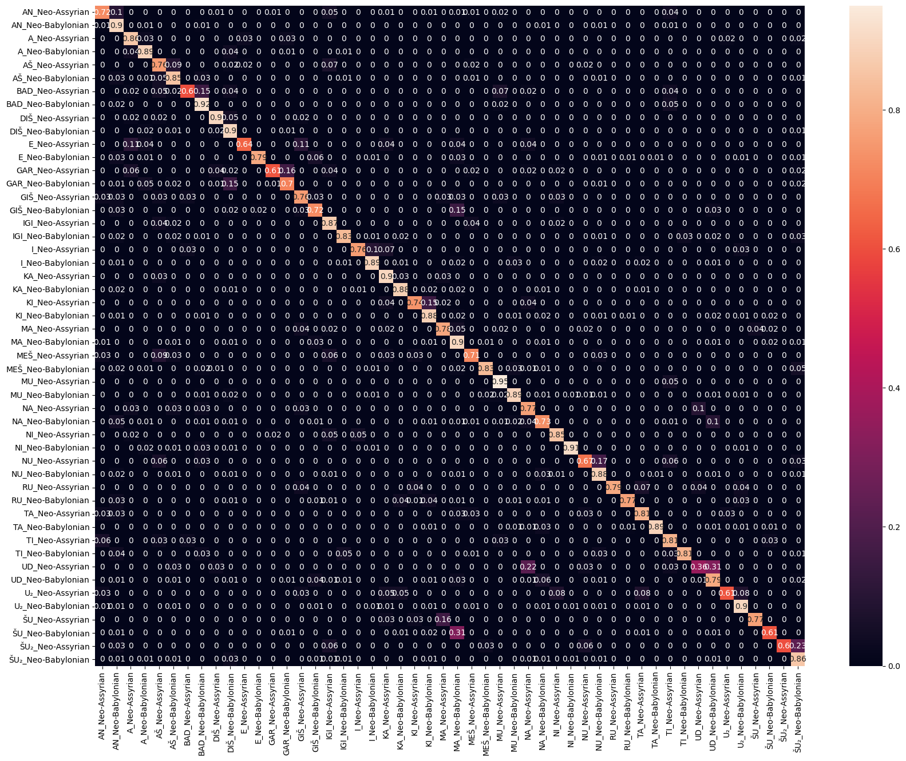

# Sign Classification Task

## Overview

This project focuses on building and training a machine-learning model to classify signs. The goal is to correctly identify and classify the era of signs based on their visual features. The project involves data preprocessing, model selection, training, and evaluation.

## Table of Contents

- [Dataset](#dataset)
- [Installation](#installation)
- [Model Selection](#model-selection)
- [Training](#training)
- [Evaluation](#evaluation)
- [Contributing](#contributing)
- [License](#license)

## Dataset

To retrieve the cropped images of signs in EBL database, please use this [script](data_retrieval/get_signs.py). It will automatically create folder data with signs, specified in `sign_filter`. 
You need to pass your database connection string to the script's arguments.

* Train Dataset - 2770 Images
* Val and Test Datasets - 923 Images

## Model Selection

For the baseline, I chose [Resnet50](https://pytorch.org/vision/main/models/generated/torchvision.models.resnet50.html).

## Training
* Transforms - Rescale((256,256)), Normalize()
* Optimizer - Adam
* Loss - Cross Entropy
* 50 epochs with Early Stopping

## Evaluation

| Class                | Accuracy (%) |
|----------------------|--------------|
| E_Neo-Assyrian       | 75.0         |
| E_Neo-Babylonian     | 88.6         |
| GAR_Neo-Assyrian     | 78.6         |
| GAR_Neo-Babylonian   | 91.0         |
| KA_Neo-Assyrian      | 82.6         |
| KA_Neo-Babylonian    | 83.7         |
| KI_Neo-Assyrian      | 63.4         |
| KI_Neo-Babylonian    | 86.4         |
| MEŠ_Neo-Assyrian     | 75.9         |
| MEŠ_Neo-Babylonian   | 84.0         |
| NI_Neo-Assyrian      | 79.4         |
| NI_Neo-Babylonian    | 73.9         |
| RU_Neo-Assyrian      | 63.6         |
| RU_Neo-Babylonian    | 84.2         |
| TA_Neo-Assyrian      | 77.8         |
| TA_Neo-Babylonian    | 90.9         |
| TI_Neo-Assyrian      | 58.3         |
| TI_Neo-Babylonian    | 94.4         |
| U₂_Neo-Assyrian      | 85.7         |
| U₂_Neo-Babylonian    | 74.5         |
| ŠU_Neo-Assyrian      | 78.3         |
| ŠU_Neo-Babylonian    | 71.1         |

